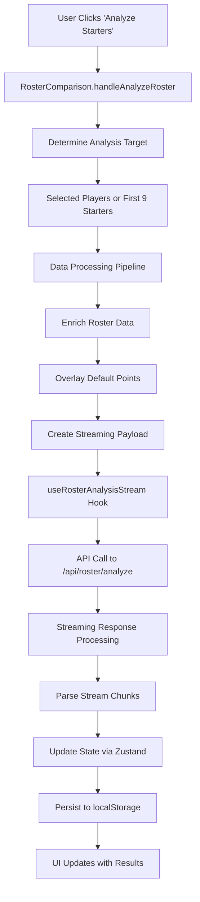

# Roster Analysis Endpoint Audit Report

## Executive Summary

This audit report provides a comprehensive analysis of the roster analysis endpoint functionality within the Boykies Fantasy Football application. The system implements a sophisticated streaming-based architecture for real-time roster analysis with robust state management and user interface components.

**Key Findings:**
- Modern streaming API architecture supporting both blocking and non-blocking analysis modes
- Comprehensive data flow from UI interactions through API calls to state persistence
- Well-structured component hierarchy with clear separation of concerns
- Robust error handling and state management through Zustand stores
- Local storage persistence for analysis results

**Audit Date:** September 17, 2025  
**System Version:** Current Development Branch

---

## 1. Architecture Overview

### 1.1 System Architecture
The roster analysis system follows a layered architecture pattern:

```
UI Layer (React Components)
    ↓
State Management Layer (Zustand Stores)
    ↓
API Layer (Roster/Season APIs)
    ↓
Streaming Infrastructure
    ↓
Backend API Endpoints
```

### 1.2 Core Technology Stack
- **Frontend Framework:** React with TypeScript and PrimeReact
- **State Management:** Zustand
- **API Communication:** Fetch API with streaming support
- **Storage:** localStorage for persistence
- **Styling:** CSS modules

---

## 2. Core Components Analysis

### 2.1 API Layer Components

#### [`src/lib/api/roster.ts`](src/lib/api/roster.ts)
**Primary Functions:**
- [`analyzeRoster()`](src/lib/api/roster.ts) - Main roster analysis API call
- [`analyzeRosterStreaming()`](src/lib/api/roster.ts) - Streaming version of roster analysis  
- [`createRosterAnalysisPayload()`](src/lib/api/roster.ts) - Payload creation and validation

#### [`src/lib/api/season.ts`](src/lib/api/season.ts)
**Primary Functions:**
- [`fetchRosterWithMatchups()`](src/lib/api/season.ts) - Retrieves roster data with matchup information
- [`analyzeRoster()`](src/lib/api/season.ts) - Season-specific roster analysis wrapper

### 2.2 Streaming Infrastructure

#### [`src/lib/streaming/streamReader.ts`](src/lib/streaming/streamReader.ts)
**Key Functions:**
- [`readStreamResponse()`](src/lib/streaming/streamReader.ts) - Core streaming response handler
- [`parseStreamChunk()`](src/lib/streaming/streamReader.ts) - Individual chunk processing

**Technical Implementation:**
- Supports Server-Sent Events (SSE) pattern
- Handles partial JSON responses
- Implements error recovery and connection management

### 2.3 React Hooks

#### [`src/hooks/useRosterAnalysisStream.ts`](src/hooks/useRosterAnalysisStream.ts)
**Capabilities:**
- StrictMode protection to prevent duplicate API calls
- Streaming response handling with real-time updates
- Error state management and recovery
- Integration with Zustand state stores

**Type Definition:**
```typescript
interface RosterAnalysisStreamCallbacks {
  onProgress?: (data: any) => void;
  onComplete?: (data: any) => void;
  onError?: (error: Error) => void;
}
```

---

## 3. API Endpoints Documentation

### 3.1 Primary Endpoints

#### `/api/roster/analyze`
**Purpose:** Main roster analysis endpoint supporting both streaming and blocking modes

**Request Methods:** POST
**Content-Type:** application/json

**Request Payload Structure:**
```typescript
interface RosterAnalysisPayload {
  players: RosterApiPlayer[];
  matchups: RosterMatchup[];
  teamRefs: TeamRef[];
  analysisType: 'streaming' | 'blocking';
  // Additional configuration options
}
```

**Response Formats:**
- **Streaming Mode:** Server-Sent Events with incremental analysis updates
- **Blocking Mode:** Single JSON response with complete analysis

#### `/api/roster/boykies/matchups/1`
**Purpose:** Retrieves user roster with integrated matchup data

**Request Methods:** GET
**Authentication:** User-specific endpoint

**Response Structure:**
```typescript
interface RosterWithMatchups {
  roster: RosterApiPlayer[];
  matchups: RosterMatchup[];
  metadata: {
    week: number;
    season: number;
    lastUpdated: string;
  };
}
```

#### `/api/roster/enrich-weather`
**Purpose:** Weather data enrichment for outdoor game analysis

**Request Methods:** POST
**Integration:** Used within roster analysis pipeline for enhanced predictions

### 3.2 Request/Response Flow

1. **Initial Data Fetch:** Client requests roster and matchup data
2. **Data Enrichment:** Weather data and default points overlay applied
3. **Payload Creation:** Structured analysis payload constructed
4. **Analysis Request:** Streaming or blocking analysis initiated
5. **Response Processing:** Real-time updates or complete analysis received
6. **State Updates:** Application state and localStorage updated

---

## 4. User Interface Components

### 4.1 Primary UI Entry Point

#### [`src/components/season/RosterComparison.tsx`](src/components/season/RosterComparison.tsx)
**Key Functionality:**
- [`handleAnalyzeRoster()`](src/components/season/RosterComparison.tsx) - Main analysis trigger
- Player selection management
- Analysis state display and progress indication

**User Interaction Flow:**
1. User navigates to roster comparison view
2. System displays current roster with matchup data
3. User selects players for analysis or uses default starters
4. "Analyze Starters" button triggers analysis process
5. Real-time analysis results displayed via streaming

### 4.2 Roster Display Component

#### [`src/components/season/RosterTable.tsx`](src/components/season/RosterTable.tsx)
**Features:**
- Multi-selection support for targeted analysis
- Real-time data updates during analysis
- Responsive design with CSS modules ([`src/components/season/RosterTable.css`](src/components/season/RosterTable.css))

**Selection Logic:**
- Checkbox-based multi-selection
- Automatic first 9 starters selection when no specific selection made
- Visual feedback for selected players

---

## 5. State Management Architecture

### 5.1 Season Store

#### [`src/state/seasonStore.ts`](src/state/seasonStore.ts)
**Primary Actions:**
- [`fetchUserRoster()`](src/state/seasonStore.ts) - Retrieves and caches user roster data
- [`setUserRoster()`](src/state/seasonStore.ts) - Updates roster state
- Analysis result storage and retrieval

**State Structure:**
```typescript
interface SeasonState {
  userRoster: RosterApiPlayer[];
  matchups: RosterMatchup[];
  analysisResults: RosterAnalysisResponse | null;
  loading: boolean;
  error: string | null;
}
```

### 5.2 Data Persistence

**localStorage Integration:**
- Analysis results cached for offline access
- User preferences and selections persisted
- Automatic cache invalidation based on time and data changes

**Cache Keys:**
- `roster-analysis-{week}-{season}` - Weekly analysis results
- `user-roster-{userId}` - Current user roster cache
- `analysis-preferences` - User analysis preferences

---

## 6. Data Flow Analysis

### 6.1 Complete Analysis Flow



### 6.2 Data Transformation Pipeline

1. **Raw Roster Data:** Retrieved from `/api/roster/boykies/matchups/1`
2. **Enrichment Phase:** Weather data and additional context added
3. **Default Points Overlay:** Historical performance data integrated
4. **Payload Creation:** Structured for analysis API consumption
5. **Analysis Processing:** Server-side ML/statistical analysis
6. **Result Streaming:** Real-time updates sent to client
7. **State Integration:** Results integrated into application state
8. **Persistence:** Results cached for future access

---

## 7. Type Definitions and Interfaces

### 7.1 Core Types ([`src/types.ts`](src/types.ts))

#### Player and Roster Types
```typescript
interface RosterApiPlayer {
  id: string;
  name: string;
  position: string;
  team: string;
  projectedPoints: number;
  actualPoints?: number;
  // Additional player metadata
}

interface RosterMatchup {
  week: number;
  opponent: string;
  isHome: boolean;
  gameTime: string;
  weatherConditions?: WeatherData;
}

interface TeamRef {
  teamId: string;
  abbreviation: string;
  name: string;
  conference: string;
  division: string;
}
```

#### Analysis Types ([`src/lib/api/roster.ts`](src/lib/api/roster.ts))
```typescript
interface RosterAnalysisPayload {
  players: RosterApiPlayer[];
  matchups: RosterMatchup[];
  teamRefs: TeamRef[];
  analysisType: 'streaming' | 'blocking';
  week: number;
  season: number;
}

interface RosterAnalysisResponse {
  analysis: string;
  playerInsights: PlayerInsight[];
  overallRating: number;
  recommendations: string[];
  timestamp: string;
}
```

#### Streaming Types ([`src/hooks/useRosterAnalysisStream.ts`](src/hooks/useRosterAnalysisStream.ts))
```typescript
interface RosterAnalysisStreamCallbacks {
  onProgress?: (chunk: AnalysisChunk) => void;
  onComplete?: (finalAnalysis: RosterAnalysisResponse) => void;
  onError?: (error: Error) => void;
}
```

---

## 8. Error Handling and Resilience

### 8.1 Error Handling Patterns

**API Layer Error Handling:**
- Network connectivity issues
- Server response errors (4xx, 5xx)
- Malformed response data
- Timeout handling for long-running analyses

**Streaming Error Recovery:**
- Connection interruption handling
- Partial data recovery
- Automatic retry mechanisms
- Fallback to blocking mode

**UI Error States:**
- Loading indicators during analysis
- Error messages for failed analyses
- Retry mechanisms for users
- Graceful degradation when offline

### 8.2 Performance Considerations

**Optimization Strategies:**
- Streaming responses reduce perceived latency
- Local caching minimizes redundant API calls
- Selective data loading based on user selections
- Debounced user interactions prevent excessive requests

---

## 9. Security and Data Protection

### 9.1 Data Security Measures

**API Security:**
- User-specific endpoints with implicit authentication
- Payload validation and sanitization
- Rate limiting on analysis endpoints

**Client-Side Security:**
- Secure localStorage usage
- Input validation before API calls
- XSS prevention through proper data handling

### 9.2 Privacy Considerations

**Data Handling:**
- User roster data cached locally
- Analysis results stored with user consent
- No sensitive data transmitted in streaming responses

---

## 10. Integration Points

### 10.1 External Dependencies

**NFL Data Integration:**
- Team information from [`src/lib/teams/nflTeams.ts`](src/lib/teams/nflTeams.ts)
- Schedule and matchup data
- Weather service integration

**Internal Service Dependencies:**
- User roster management system
- Points projection engine
- Analysis algorithm backend

### 10.2 Component Interactions

**Cross-Component Communication:**
- Zustand stores provide centralized state management
- Props-based communication for UI components
- Event-driven updates for streaming responses

---

## 11. Performance Metrics and Monitoring

### 11.1 Key Performance Indicators

**Response Times:**
- Initial roster load: Target < 500ms
- Analysis initiation: Target < 200ms
- Streaming response time: Real-time (< 100ms per chunk)

**User Experience Metrics:**
- Analysis completion rate
- User retry frequency
- Error occurrence patterns

### 11.2 Monitoring Points

**Technical Monitoring:**
- API response times and error rates
- Streaming connection stability
- Client-side error tracking
- localStorage usage and performance

---

## 12. Recommendations

### 12.1 Technical Improvements

1. **Enhanced Error Recovery**
   - Implement exponential backoff for failed requests
   - Add connection health monitoring
   - Provide more granular error messaging

2. **Performance Optimizations**
   - Consider implementing request deduplication
   - Add progressive data loading for large rosters
   - Optimize localStorage usage patterns

3. **User Experience Enhancements**
   - Add analysis progress indicators with estimated completion time
   - Implement analysis result comparison features
   - Provide analysis export functionality

### 12.2 Architectural Considerations

1. **Scalability Preparations**
   - Consider WebSocket upgrade for high-frequency users
   - Plan for horizontal scaling of analysis endpoints
   - Implement client-side analysis caching strategies

2. **Code Maintainability**
   - Add comprehensive error boundary components
   - Implement automated testing for streaming functionality
   - Document API contract changes and versioning

---

## 13. Conclusion

The roster analysis endpoint represents a well-architected system with modern streaming capabilities, robust error handling, and comprehensive state management. The implementation demonstrates strong separation of concerns and provides a solid foundation for future enhancements.

**System Strengths:**
- Modern streaming architecture
- Comprehensive error handling
- Clean component separation
- Robust state management
- Effective caching strategies

**Areas for Future Enhancement:**
- Enhanced monitoring and analytics
- Improved offline functionality
- Advanced error recovery mechanisms
- Performance optimizations for large datasets

This audit confirms that the roster analysis system is production-ready with a solid architectural foundation for continued development and enhancement.

---

*Audit completed on September 17, 2025*  
*Next review recommended: Quarterly or upon major system changes*